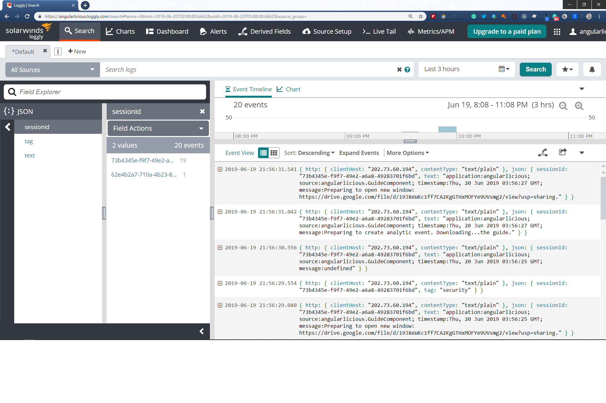

# Use Rxjs to Push Configuration to Angular Libraries


> A working solution available at Github. https://github.com/angularlicious/configuration-for-libraries

The Angular Workspace provides the ability to have multiple library and application projects in a single environment. Although this capability has been available since version 6, I find that many developers and teams are not taking full advantage of shared libraries. Having the ability to share and reuse code in the form of libraries adds to the effectiveness of your development team.

Think of the many shared libraries that would benefit your Angular applications. Here is a list of different library types that are common to applications.

- features
  - security
  - shopping cart
  - account management
- cross-cutting concerns
  - configuration
  - logging
  - error handling
  - notifications
- utilities
  - HTTP service
- frameworks
  - rule engine
  - business logic actions
- foundational
  - base classes for Angular services or components

There are many opportunities to create libraries for our Angular applications. However, one of the difficulties is getting configuration to these libraries. This post will demonstrate how an Angular application can provide configuration to Libraries in an Angular Workspace environment. The focus will be on providing configuration to libraries. The _Logging_ and _ErrorHandling_ libraries volunteered to participate in this demonstration. However, the process and patterns could be used for any type of library in the Workspace.


## What We Get from Angular

Angular applications have an _environment_ context that provides configuration items targeting specific environments for the application. Angular libraries in the _Workspace_ cannot access the _environment_ context. Applications reference and use libraries - and Angular Libraries may reference and use other libraries. If libraries had access to the _environment_ context it would cause a **circular dependency**.

One of the main tenets of developing reusable libraries is to keep them generic enough to be reused by many applications and libraries. Therefore, the next evolution of the target library is to create _configuration_ for elements that can vary. Therefore, libraries need configuration.

> Note: Not all library projects need configuration, but when they do, they prefer it pushed.

## Libraries Need Configuration Too

The target Angular application is the source of the configuration and has the responsibility to provide that configuration to the specified library items. Since the environment context is part of the Application's domain, the library cannot reference and use this for its configuration.

> Note: The `environment` context is an object with data elements. It is not strongly typed in terms of its schema. However, the members of the _environment_ context are typed - however, there is not defined object type.

No need to worry, we can use some simple patterns and create a strongly-typed mechanism for library configuration.

## Provide Strongly-Typed Configuration to Angular Libraries

Here is what needs to happen to enable configuration for libraries.

1. each _library_ will define its own _configuration_ schema or object type
2. each _library_ will define an _interface_ for the structure of the specific configuration
3. each _library_ will subscribe to _publish_ events of configuration
4. library configuration will be _pushed_ to libraries
5. each _library_ has the responsibility to validate the configuration provided
6. each _library_ has the responsibility to define default values for any required items.
7. each _application_ will retrieve the _configuration_
8. a _service_ will provide the mechanism to _publish_ configuration to library subscribers.

The _linchpin_ in this scenario will be a new Configuration service that will act as a mediator between applications with configuration and the libraries that need that configuration. It is following an inversion of control pattern where libraries cannot retrieve or instantiate their own configuration - it will be provided to them. Applications will use the new _Configuration_ service to publish configuration.

> The main **goal** is to use a push strategy. The libraries should not pull or request their own configuration. It is not their responsibility to have such knowledge. Therefore, we will let the libraries react to published events of configuration when applications provide it.

## Configuration Library

Create a new library in your Angular Workspace. It will be used to mediate the transfer of configuration information from applications to libraries with configuration requirements.

```ts
ng generate library configuration --publishable --unit-test-runner=jest
```

Add a new _ConfigurationService_ to the library. This is a very straight-forward service. It does one thing and it does it very well. It provides the configuration from the application to any subscribers. The target subscribers in our context are libraries. However, the service could also be used by other modules, components, and services within the application.

- the `settings$` is a [ReplaySubject](https://rxjs-dev.firebaseapp.com/api/index/class/ReplaySubject) that buffers a set of values and emits the values immediately to subscribers
  - the ReplaySubject will buffer or keep the _one_ configuration available to emit to all subscribers no matter when or where they subscribe.
- a _ConfigurationContext_ is injected into the constructor of the service.

```ts
import { Injectable, Optional } from "@angular/core";
import { ConfigurationContext } from "./configuration-context";
import { Subject, ReplaySubject } from "rxjs";
import { IConfiguration } from "./i-configuration";

@Injectable({
  providedIn: "root"
})
export class ConfigurationService {
  settings$: Subject<IConfiguration> = new ReplaySubject<IConfiguration>(1);

  constructor(@Optional() context: ConfigurationContext) {
    if (context) {
      this.settings$.next(context.config);
    }
  }
}
```

The _ConfigurationContext_ is just a container class for anything that can be provided to the ConfigurationModule and made available to members of that module, like the _ConfigurationService_. We could pass the actual configuration directly, but I like to keep my options open for future opportunities.

```ts
import { IConfiguration } from "./i-configuration";

export class ConfigurationContext {
  config: IConfiguration;
}
```

### Interface-Driven Configuration

Notice that the `settings$` ReplaySubject is of type `IConfiguration`. We are using an interface-driven approach to allow the interfaces to define the types for each library configuration. The `IConfiguration` provides the container type for all configuration members.

```ts
export interface IConfiguration {
  applicationName: string;
  version: string;
}
```

## Providing the Configuration to Libraries

If you are wondering how the _ConfigurationContext_ is provided to the _ConfigurationModule_, the library's module has a static `forRoot()` method to allow applications to provide the library with the specified configuration.

The _ConfigurationContext_ is just a class to define the members of the context. Currently, it only has a _config_ property. The members of this class are available to the ConfigurationModule when they are set as one of the `providers` of the module. Basically, the `forRoot()` allows the module to have the input setup as a provider - the _ConfigurationContext_ is now available for dependency injection. The service now has direct access to this input because it is injected into the constructor of the _ConfigurationService_.

```ts
import { NgModule, ModuleWithProviders } from "@angular/core";
import { CommonModule } from "@angular/common";
import { ConfigurationContext } from "./configuration-context";
import { HttpClientModule } from "@angular/common/http";

@NgModule({
  imports: [CommonModule],
  providers: []
})
export class ConfigurationModule {
  static forRoot(configContext: ConfigurationContext): ModuleWithProviders {
    console.log(`Preparing to handle configuration context.`);
    return {
      ngModule: ConfigurationModule,
      providers: [
        {
          provide: ConfigurationContext,
          useValue: configContext
        },
        HttpClientModule
      ]
    };
  }
}
```

The _ConfigurationService_ in the ConfigurationModule contains a public _ReplaySubject_. The `ConfigurationService` is injected into the constructor of the service. This allows the _LoggingService_ to subscribe to _configuration_ events from the ConfigurationService. When the configuration is emitted, this service will use the provided value (i.e., IConfiguration ).

The `log()` method allows the _LoggingService_ to emit a new LogEntry item. The LogWriters configured by the application will respond by sending the specified log entry to the target repository and/or the console. To recap, the LoggingService only does (2) things:

1. uses the `LoggingConfig` provided by the ConfigurationService to setup some of the logging information
2. creates `LogEntry` items and publishes them to subscribed log writers.

```ts
import { Injectable, Optional } from "@angular/core";

import { Severity } from "./severity.enum";
import { IConfiguration, LoggingConfig } from "@angularlicious/configuration";
import { ConfigurationService } from "@angularlicious/configuration";
import { LogEntry } from "./log-entry";
import { Subject, ReplaySubject } from "rxjs";
import { ILogEntry } from "./i-log-entry";
import { ILoggingConfig } from "./config/i-logging-config";

@Injectable()
export class LoggingService {
  serviceName = "LoggingService";
  source: string;
  severity: Severity;
  message: string;
  timestamp: Date;
  applicationName = "application";
  version = "0.0.0";
  isProduction: boolean;
  config: LoggingConfig;

  logEntries$: Subject<ILogEntry> = new ReplaySubject<ILogEntry>(1);

  constructor(@Optional() public configService: ConfigurationService) {
    this.timestamp = new Date(Date.now());
    this.log(
      this.serviceName,
      Severity.Information,
      `Starting logging service at: ${this.timestamp}`
    );

    if (configService) {
      this.configService.settings$.subscribe(settings =>
        this.handleSettings(settings)
      );
    }
  }

  handleSettings(settings: IConfiguration) {
    this.config = settings as LoggingConfig;
    this.applicationName =
      this.config && this.config.loggingConfig.applicationName
        ? this.config.loggingConfig.applicationName
        : "application";
    this.version =
      this.config && this.config.loggingConfig.version
        ? this.config.loggingConfig.version
        : "0.0.0";
    this.isProduction =
      this.config && this.config.loggingConfig.isProduction
        ? this.config.loggingConfig.isProduction
        : false;
  }

  log(source: string, severity: Severity, message: string, tags?: string[]) {
    this.source = `${this.applicationName}.${source}`;
    this.severity = severity;
    this.message = message;
    this.timestamp = new Date(Date.now());

    const logEntry = new LogEntry(
      this.applicationName,
      this.source,
      this.severity,
      this.message,
      tags
    );
    this.logEntries$.next(logEntry);
  }
}
```

### Library Configuration Recipe

This is a functional logging service that can be used by any number of applications and also by other Angular libraries.This is an important part of the library configuration recipe.

1. a _ConfigurationService_ is **injected** into the library service constructor.
2. the library service **subscribes** to the _ReplaySubject_ for configuration events.
3. the service **handles** a configuration value emitted by the ReplaySubject.
4. the service can **validate** and provide any required **default** values based on the configuration

> Note: You can learn more about the log writers by reviewing the code in the GitHub repository. https://github.com/angularlicious/configuration-for-libraries

## Application Configuration

The actually configuration for the application should be consistent and typed. It should also be environment specific. Therefore, the application should have a configuration defined for each application environment. Use the same convention of the _environment_ constant.

- app.config.development.ts
- app.config.stage.ts
- app.config.production.ts

The _AppConfig_ shown below shows the implementation of an application configuration. This configuration is typed and is based on interfaces. Since it is a Typescript object, there is no need to load the configuration using HTTP or importing a JSON file.

> Note: Originally, the solution used JSON files for the configuration. The application imported the JSON file or supplied the path to the file to an HTTP GET call. This could work well in a scenario where you would like to replace the JSON file during the CI/Build process for specific environments. Keep important or private information secure!

```ts
import {
  IConfiguration,
  IErrorHandingConfig,
  ILogglyConfig
} from "@angularlicious/configuration";
import { ILoggingConfig } from "@angularlicious/logging";

export class AppConfig implements IConfiguration {
  applicationName: "BuildMotion";
  version: "2.0.0";
  loggingConfig: ILoggingConfig = {
    applicationName: this.applicationName,
    isProduction: false,
    version: this.version
  };
  errorHandlingConfig: IErrorHandingConfig = {
    applicationName: this.applicationName,
    includeDefaultErrorHandling: true
  };
  logglyConfig: ILogglyConfig = {
    apiKey: "ADD-YOUR-API-KEY-HERE",
    sendConsoleErrors: true
  };
}
```

Now, each environment (i.e., development, stage, or production) can target the specified configuration and make it available using the `appConfig` property of the _environment_ object.

```ts
import { IConfiguration } from "@angularlicious/configuration";
import { AppConfig } from "../assets/config/app.config.development";

const applicationConfig: IConfiguration = new AppConfig();

export const environment = {
  appConfig: applicationConfig,
  production: false
};
```

The application's configuration is now ready. The _ConfigurationModule_ is imported and the application's configuration is provided to the module using the static `forRoot()` method. This module has the responsibility to load the library services and to provide the configuration.

```ts
import { NgModule, APP_INITIALIZER, ErrorHandler } from "@angular/core";
import { CommonModule } from "@angular/common";
import {
  LoggingService,
  LoggingModule,
  LogglyWriter
} from "@angularlicious/logging";
import {
  ConfigurationService,
  ConfigurationModule
} from "@angularlicious/configuration";
import { ConsoleWriter } from "@angularlicious/logging";
import {
  ErrorHandlingModule,
  ErrorHandlingService
} from "@angularlicious/error-handling";
import { environment } from "./../../../environments/environment";

/**
 * The factory function to initialize the logging service and writer for the
 * application.
 *
 * @param loggingService
 * @param consoleWriter
 */
export function initializeLogWriter(consoleWriter: ConsoleWriter) {
  console.log(`Initializing [Console Writer] from [AppModule]`);
  return () => {
    return consoleWriter;
  };
}
@NgModule({
  declarations: [],
  imports: [
    CommonModule,
    ErrorHandlingModule,
    LoggingModule,
    ConfigurationModule.forRoot({ config: environment.appConfig })
  ],
  providers: [
    ConfigurationService,
    LoggingService,
    ConsoleWriter,
    LogglyWriter,
    {
      provide: ErrorHandler,
      useClass: ErrorHandlingService
    },
    {
      provide: APP_INITIALIZER,
      useFactory: initializeLogWriter,
      deps: [LoggingService, ConsoleWriter, LogglyWriter],
      multi: true
    },
    {
      provide: ErrorHandler,
      useClass: ErrorHandlingService,
      deps: [ConfigurationService, LoggingService]
    }
  ]
})
export class LibraryInitializerModule {}
```

## Conclusion: (Bonus: Plug-in Services)

Notice that the module is using the `APP_INITIALIZER` to initialize the log _writers_. What are log writers? Well, the LoggingService has the responsibility to provide an endpoint for the application to send a log message and other details. The _writers_ have the responsibility to write/send the message to a target. The _ConsoleWriter_ simply logs events to the browser's console. You can view the log messages in the developer tools console. This works great for development. However, in non-production environments, the log items should be stored in a centralized repository.

The _LogglyWriter_ writes the log messages to [Loggly](https://www.loggly.com/) - a cloud-based provider. This implementation uses [Loggly](https://www.loggly.com/) for a centralized repository of application logs. There are several cloud-based solutions to choose for centralized logging. A centralized repository allows you to monitor, filter, and analyze log events for your Angular applications.

All of this made possible using Angular Libraries and typed Configuration from the application.


